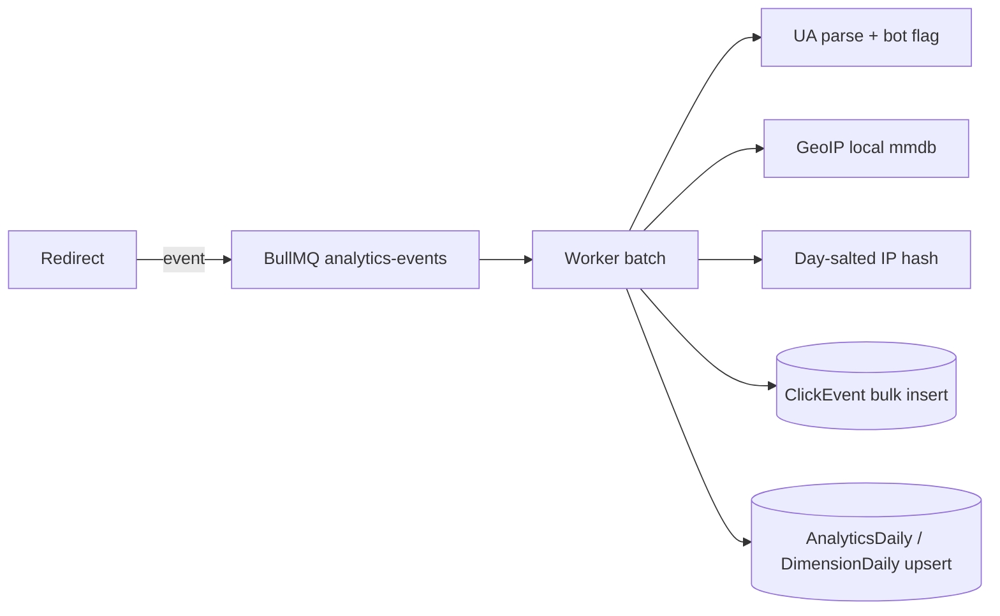

# Analytics

The redirect process only enqueues `{eventId, linkId, workspaceId, campaignId, timestamp, ip, userAgent, referer, acceptLanguage}`. Parsing, geo and storage all happen in the worker. Raw IPs live only in the queue payload (short-lived) and are never written to Postgres; `ipHash` uses a per-day salt derived from `SESSION_SECRET`.

## Accuracy (read this before trusting a number)

- **Unique visitors are approximate**: hash(day-salted IP + user-agent), counted once per link per UTC day. Shared NATs undercount; changing networks overcounts.
- **Bot detection is heuristic** (user-agent patterns). Bot clicks are stored and counted separately, never dropped.
- **GeoIP is approximate**, especially city/region, and VPNs/mobile carriers distort it.
- **Referrers are often absent** (privacy settings, apps, QR scans).
- **Time zones**: rollups are bucketed by UTC day. Non-UTC dashboards are approximate at day edges.

Operators are responsible for compliance with the privacy laws that apply to them; this software does not make a deployment compliant on its own.

## Implementation

### Publishing (redirect service)

`BullmqPublisher` buffers events in memory and enqueues them as **batches** on the `analytics-events` queue: one BullMQ job per `ANALYTICS_BATCH_FLUSH_MS` (default 250 ms) or `ANALYTICS_BATCH_MAX` (default 500) events, whichever comes first. One job per click would cost several Redis round trips per redirect; batching makes that roughly 100x fewer operations at burst rates.

- `publish()` is synchronous and never throws or waits.
- If the queue is unreachable, events stay buffered and are retried (not more than about once a second); memory is bounded by `ANALYTICS_BUFFER_MAX` (default 20,000), beyond which the **oldest** events are dropped, counted and logged.
- On shutdown the buffer is drained with a deadline. A hard crash can lose at most the unflushed buffer (about one flush interval). This is an accepted trade-off: analytics is secondary to redirects.
- Jobs are retried 5 times with exponential backoff (2 s, 4 s, ...), then **kept for 14 days** (up to 10,000) in the failed set for inspection (the dead-letter queue); completed jobs are pruned after an hour.

### Processing (worker)

`BatchProcessor.process()` handles one job in **one Postgres transaction**:

1. Validate each event (malformed ones are dropped and counted, never failing the batch); enrich with user agent, bot flag, GeoIP, referrer host, language and the day-salted hashes.
2. Bulk insert into `ClickEvent` with `ON CONFLICT DO NOTHING RETURNING id`. Only rows that were actually inserted continue, so a redelivered or retried batch can never be counted twice (verified end to end).
3. Insert `DailyVisitor` rows the same way; a visitor counts as new for (day, link) only if its row did not exist.
4. Upsert `AnalyticsDaily` (clicks, unique visitors, device split) per (day, link, isBot) and `AnalyticsDimensionDaily` (country, region, city, device, browser, OS, referrer, UTM source/medium/campaign) with additive `ON CONFLICT DO UPDATE`. Rows are sorted by key before writing so concurrent workers lock in the same order.

If anything fails, the whole transaction rolls back and BullMQ retries the job.

### What is stored, and what is not

- **Never stored:** raw IP addresses, full referrer URLs (only the host), query strings, GeoIP coordinates.
- `visitorHash` and `ipHash` = truncated SHA-256 over a **per-UTC-day salt** (HMAC of the date under `SESSION_SECRET`) plus the IP (and user agent for `visitorHash`). Rotating `SESSION_SECRET` also changes future hashes; it does not affect stored aggregates.
- `ipHash` is stored only when the workspace has IP hashing enabled (the default). `visitorHash` is always computed because unique visitors need it.
- Bot clicks are stored, flagged `isBot`, and aggregated in separate rows so the UI can include or exclude them. The workspace `filterBots` setting changes what is shown, not what is stored.

### Cardinality caps

Referrer, region and city values are controlled by visitors or the network, so per (link, day) only the first **100** distinct values of each are kept; anything beyond that is counted under `other`, preserving the click total. Without this, a script sending random `Referer` headers could grow the rollup tables without bound.

### Known limitations (by design, documented rather than hidden)

- **Unique visitors across a date range = the sum of daily uniques.** Because the salt rotates daily (so people cannot be tracked across days), a returning visitor counts once per day. Multi-day totals therefore overstate true distinct people.
- **Campaign attribution in daily rollups follows the link's campaign at processing time**, so moving a link to another campaign mid-day shifts that day's rollup. Raw `ClickEvent` rows keep the campaign at click time.
- **UTM values in analytics come from the link's configuration**, not from visitors (short URL query strings are not forwarded), so they are bounded and trustworthy for attribution, but they are looked up when the batch is processed (cached up to 60 s).
- Worker memory includes the GeoIP database (about 130 MB for DB-IP city-lite).

## Query API

All endpoints are under `/api/v1/workspaces/:id` and need `analytics:read`: `GET /analytics`, `GET /links/:linkId/analytics`, `GET /campaigns/:campaignId/analytics`.

| Query parameter                                                   | Meaning                                                                                              |
| ----------------------------------------------------------------- | ---------------------------------------------------------------------------------------------------- |
| `from`, `to`                                                      | Inclusive **local** dates `YYYY-MM-DD` in `timezone`. Default: the last 30 days. Max range 366 days. |
| `timezone`                                                        | IANA name. Default: the workspace timezone (default `UTC`).                                          |
| `granularity`                                                     | `day` (default) or `hour` (max 14 days).                                                             |
| `linkId`, `campaignId`                                            | Scope filters (verified to belong to the workspace; foreign ids are `404`).                          |
| `country` (ISO-2), `device` (`MOBILE`/`DESKTOP`/`TABLET`/`OTHER`) | See "Filtered queries" below.                                                                        |
| `includeBots`                                                     | `true`/`false`. Default: the opposite of the workspace `filterBots` setting.                         |
| `limit`                                                           | Top-N for each breakdown, 1-50 (default 10).                                                         |

Response: `summary` (`clicks`, `humanClicks`, `botClicks`, `uniqueVisitors`, `qrScans`), `timeline` (zero-filled), `countries`, `regions`, `cities`, `devices`, `browsers`, `os`, `referrers`, `utmSources`, `utmMediums`, `utmCampaigns`, `qrCodes` (with names), `topLinks` (labelled, workspace/campaign scope only) and `meta` (resolved timezone/range, `source`, and `notes` about accuracy). Raw events are never returned.

### How it stays fast and correct

- The default path reads only the small rollup tables; the dashboard never scans `ClickEvent`.
- **Timezones:** the worker also writes **15-minute buckets** (`AnalyticsBucket`, UTC). Timelines and click totals are computed by grouping buckets in the requested timezone, so they are exact for any offset, including +5:30 and +5:45. Unique visitors and the breakdowns come from UTC-day rollups, so in a non-UTC timezone they can differ slightly at the edges of the range (the response says so in `meta.notes`). In UTC everything is exact and consistent.
- **Filtered queries:** rollups are per-dimension, so they cannot answer "browsers among visitors from India". Requests with `country` or `device` use a bounded aggregation over `ClickEvent` (`meta.source: "events"`), limited to **31 days**.
- Ties in rankings break alphabetically, so results are deterministic.

### CSV export

`GET .../analytics/export` (also under `/links/:id` and `/campaigns/:id`), needs `analytics:export` (MEMBER and above), 5 per minute per workspace.

- `type=daily` (default): rollup rows per UTC day, link and bot flag.
- `type=events`: raw clicks, **without IPs or visitor hashes**. Limited to 1,000,000 rows (narrow the range if exceeded).
  Both stream in keyset-paginated batches of 5,000 with backpressure, so memory stays flat. Cells starting with `= + - @` are prefixed with `'` to defuse spreadsheet formula injection (referrers and UTM values are not fully trusted).
