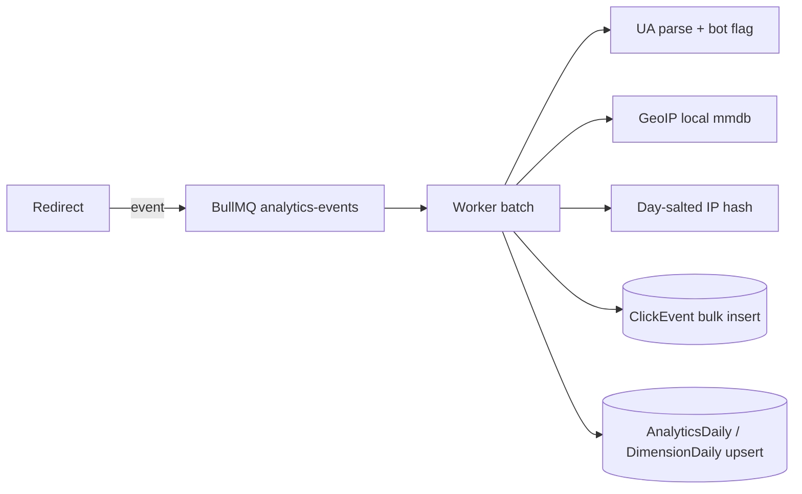

# Analytics

The redirect process only enqueues `{eventId, linkId, workspaceId, campaignId, timestamp, ip, userAgent, referer, acceptLanguage}`. Parsing, geo and storage all happen in the worker. Raw IPs live only in the queue payload (short-lived) and are never written to Postgres; `ipHash` uses a per-day salt derived from `SESSION_SECRET`.

## Accuracy (read this before trusting a number)

- **Unique visitors are approximate**: hash(day-salted IP + user-agent), counted once per link per UTC day. Shared NATs undercount; changing networks overcounts.
- **Bot detection is heuristic** (user-agent patterns). Bot clicks are stored and counted separately, never dropped.
- **GeoIP is approximate**, especially city/region, and VPNs/mobile carriers distort it.
- **Referrers are often absent** (privacy settings, apps, QR scans).
- **Time zones**: rollups are bucketed by UTC day. Non-UTC dashboards are approximate at day edges.

Operators are responsible for compliance with the privacy laws that apply to them; this software does not make a deployment compliant on its own.
