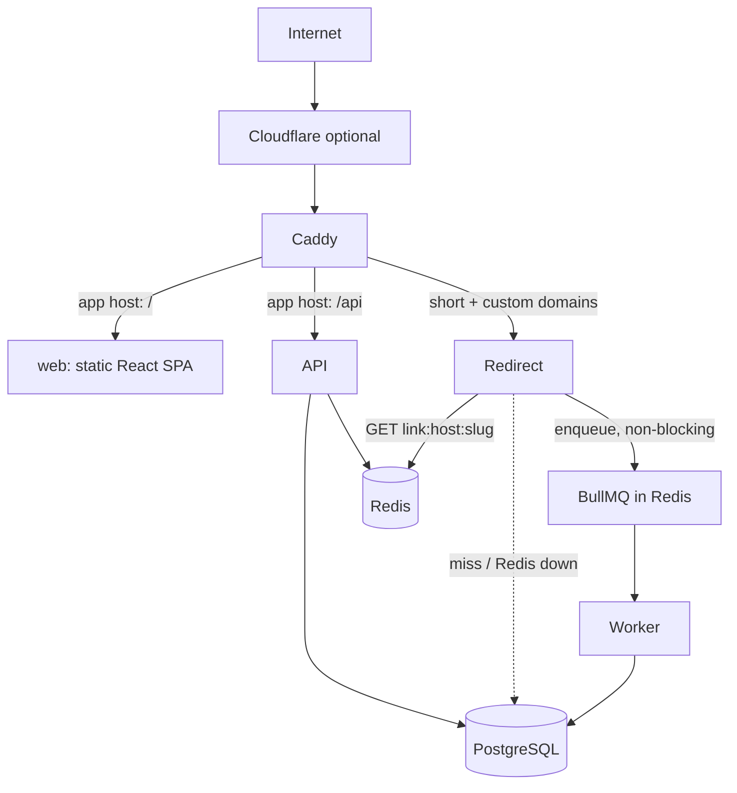

# Architecture

Four deployables, one backend image (`api`, `redirect`, `worker` differ only by command), plus Postgres and Redis. No microservices, no Kafka/K8s: a single VPS runs everything, and every process is stateless so any of them can be replicated.

## Decisions

| Decision                                                         | Reason                                                         |
| ---------------------------------------------------------------- | -------------------------------------------------------------- |
| npm workspaces                                                   | Single package manager, no extra tooling.                      |
| Apps bundled with tsup, packages consumed as TS source           | No per-package build step; one typecheck pass.                 |
| Server-side sessions in Postgres (hashed token, httpOnly cookie) | Revocable, works across API replicas, nothing in localStorage. |
| Redis is a cache and queue transport, never the source of truth  | Redis loss costs cache warmth and in-flight events, not data.  |
| Prisma 7 + `@prisma/adapter-pg`                                  | Pinned to 7.x; 8.x is still a release candidate.               |

## Tenant isolation

Workspace id is never taken from the client body. Routes are `/api/v1/workspaces/:workspaceId/...`; middleware loads the caller's membership for that id (404 if none, so existence is not leaked) and every query is scoped by the verified `workspaceId`.

## Packages

`database` (Prisma + singleton), `config` (env validation), `shared` (permissions, slug/URL rules, errors), `validation` (Zod request schemas).
