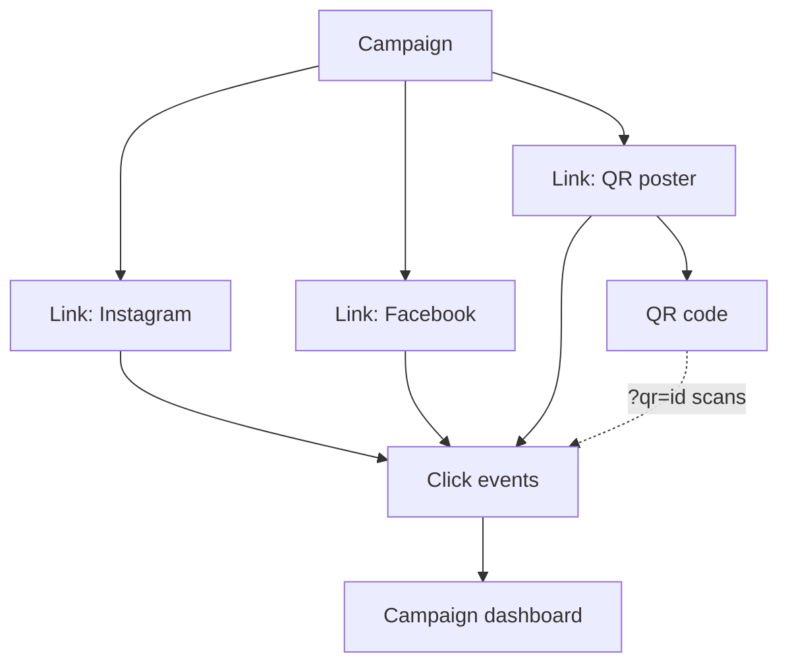

# Campaigns

A campaign groups links and QR codes and rolls their analytics into one view. It is a real entity (not a tag on a link).

## API (`/api/v1/workspaces/:id/campaigns`)

`GET /` (cursor, `q` search), `POST /`, `GET /:id`, `PATCH /:id`, `DELETE /:id`, `GET /:id/analytics`, `GET /:id/analytics/export`.

Fields: `name` (required), `description`, `startDate`, `endDate` (must not precede `startDate`, also checked against the stored value when only one side is patched), `utmCampaign`. Responses include `linkCount` and `qrCodeCount`.

Links join a campaign with `campaignId` on create/update (workspace-checked, so another tenant's campaign id is `404`). QR codes inherit the link's campaign unless one is given.

## UTM

Each link carries its own `utmSource`, `utmMedium`, `utmCampaign`, `utmTerm`, `utmContent`; they are merged into the destination at redirect time (values already on the destination win, so nothing is duplicated). A campaign's `utmCampaign` is a **default**: a link created in the campaign (or moved into it without its own value) inherits it. Example: Instagram `instagram/social`, Facebook `facebook/social`, QR `offline/qr`, all with `utm_campaign=diwali2026`.

## Analytics

`GET .../campaigns/:id/analytics` returns the standard analytics response scoped to the campaign: totals, **QR scans**, unique visitors, timeline, top links, countries/cities, devices, browsers, OS, referrers and the UTM source/medium/campaign breakdowns. See [analytics.md](analytics.md). Campaigns are never ranked "best/worst"; only facts are shown.

## Behaviour to know

- **Deleting a campaign keeps its links and QR codes**; they become campaign-less. Their cached redirect entries (which carry the campaign id) are purged so new clicks are not attributed to a deleted campaign.
- Daily rollups attribute a day's clicks to the link's **current** campaign; raw click events keep the campaign at click time (see analytics limitations).
- `FEATURE_CAMPAIGNS=false` disables the whole router and campaign assignment.
- Permissions: read = VIEWER+, create/edit/delete = MEMBER+.
