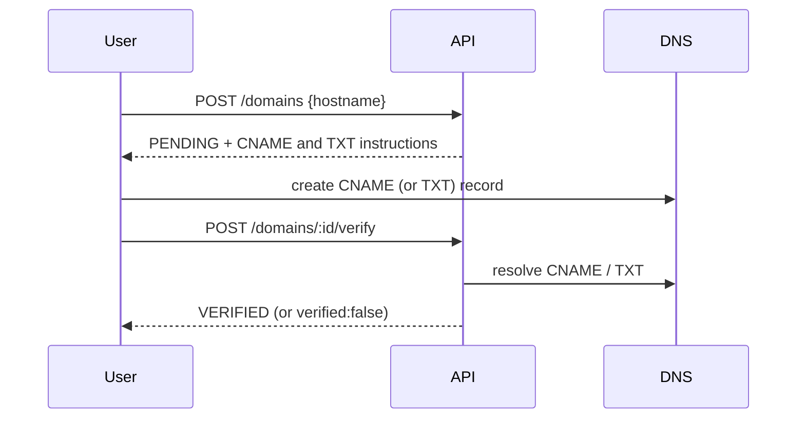

# Custom domains

## Model

- `Domain.hostname` is globally unique, so a hostname can belong to only one workspace.
- The platform's own short domain (`DEFAULT_SHORT_DOMAIN`) is a **shared domain**: a `Domain` row with `workspaceId = null`, created idempotently at API start-up. Every workspace can create links on it; slugs on it are unique across all tenants (so a taken slug reveals that the slug exists somewhere — pick random slugs for anything sensitive). Shared domains cannot be edited, disabled or deleted through the API.
- Links may only use a domain that is the workspace's own or shared, **and** `VERIFIED`.

## Flow

Records shown to the user:

| Type                                            | Name                               | Value                                   |
| ----------------------------------------------- | ---------------------------------- | --------------------------------------- |
| CNAME (preferred for subdomains)                | `links.client.com`                 | the host part of `DEFAULT_SHORT_DOMAIN` |
| TXT (apex domains, or proxied/flattened CNAMEs) | `_goshort-verify.links.client.com` | the per-domain `verificationToken`      |

Either record verifies the domain. DNS errors (NXDOMAIN, timeouts) count as "not verified"; verification is rate limited to 10/min per workspace.

## HTTPS

Caddy provisions certificates on demand for custom hostnames, asking the API whether a hostname is a verified domain before issuing (so arbitrary Host headers cannot trigger certificate issuance). See [deployment.md](deployment.md).

## Rules and limits

- Rejected: IP literals, single-label names, `localhost`, ports, and the platform's own hosts (app host, short domain).
- Disabling a domain purges every cached link under it; re-enabling restores it. Deleting is refused while the domain still has links (deleting would cascade to links and QR codes).
- **Squatting limitation:** an unverified claim blocks the hostname for other workspaces. A cleanup job will expire unverified domains after 7 days (planned with the cleanup jobs).
