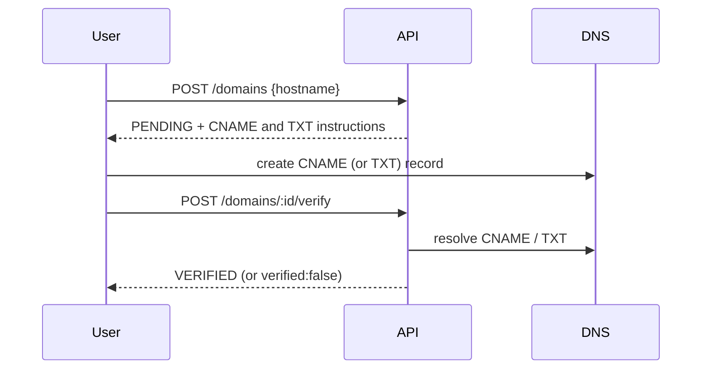

# Custom domains

## Model

- `Domain.hostname` is globally unique, so a hostname can belong to only one workspace.
- The platform's short domains are **shared domains**: `Domain` rows with `workspaceId = null`. The first is seeded from `DEFAULT_SHORT_DOMAIN` when the database has none; after that they are added, defaulted, disabled and removed by a super admin in the console ([console.md](console.md#short-domains)). Every workspace can create links on every active one; slugs on a shared domain are unique across all tenants (so a taken slug reveals that the slug exists somewhere — pick random slugs for anything sensitive). Workspaces cannot edit or delete shared domains through the workspace API.
- Links may only use a domain that is the workspace's own or shared, **and** `VERIFIED`.

## Flow

Records shown to the user:

| Type                                            | Name                               | Value                                      |
| ----------------------------------------------- | ---------------------------------- | ------------------------------------------ |
| CNAME (preferred for subdomains)                | `links.client.com`                 | the host part of the default shared domain |
| TXT (apex domains, or proxied/flattened CNAMEs) | `_goshort-verify.links.client.com` | the per-domain `verificationToken`         |

Either record verifies the domain. DNS errors (NXDOMAIN, timeouts) count as "not verified"; verification is rate limited to 10/min per workspace.

## HTTPS

Caddy provisions certificates on demand for custom hostnames. Before issuing, it calls `GET /internal/tls-check?domain=<host>&token=<INTERNAL_API_TOKEN>` on the API, which returns 200 only for an active shared domain or a `VERIFIED` custom domain, so arbitrary Host headers cannot trigger certificate issuance. The token is required in production (`INTERNAL_API_TOKEN`), and the proxy must not route `/internal/*` publicly. See [deployment.md](deployment.md).

## Rules and limits

- Rejected: IP literals, single-label names, `localhost`, ports, and the platform's own hosts (app host, short domain).
- Disabling a domain purges every cached link under it; re-enabling restores it. Deleting is refused while the domain still has links (deleting would cascade to links and QR codes).
- **Squatting limitation:** an unverified claim blocks the hostname for other workspaces. `deleteStalePendingDomains` releases unverified, link-less claims after 7 days (scheduled by the BullMQ cleanup queue).
- **DNS drift:** verification is a one-time proof. If a customer later removes their DNS records, the domain stays `VERIFIED` until an admin disables it; periodic re-verification is not implemented.
- **Slugs** are case-sensitive (`Sale` and `sale` are different links) but reserved words match case-insensitively.
