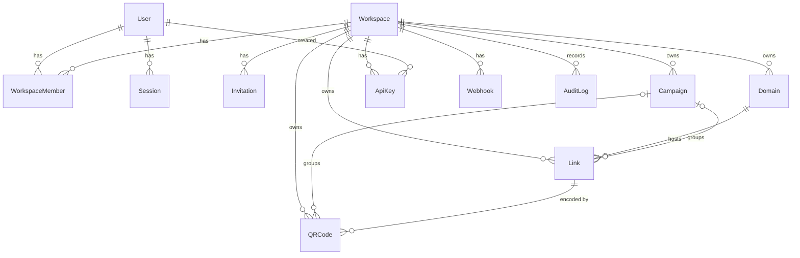

# Database

PostgreSQL 17 via Prisma 7 (`@prisma/adapter-pg`, one pooled client per process; pool size `DATABASE_POOL_MAX`, default 10). Schema: `packages/database/prisma/schema.prisma`; migrations are committed under `packages/database/prisma/migrations` and applied with `prisma migrate deploy`.

## Tenancy

Every tenant-owned table carries `workspaceId`, and every query is scoped by the workspace that was **derived from the caller's membership or API key** (never from a client-supplied id alone). The one exception by design is the platform-shared default domain: a `Domain` row with `workspaceId = NULL` that every workspace may attach links to; slugs on it are unique across tenants.

## Tables

### Identity and access

- **User**: `email` (unique, stored lower-case), Argon2id `passwordHash`, `systemRole` (`USER`/`ADMIN`, the platform-admin flag).
- **Session**: SHA-256 of the cookie token (`tokenHash`, unique), a per-session `csrfToken`, `expiresAt`. Deleted when expired (cleanup job), on logout, and on password change/reset.
- **AuthToken**: hashed single-use password-reset / email-verify tokens.
- **Workspace**: `slug` (unique), `timezone`, privacy settings `hashIps`, `filterBots`, `retentionDays` (NULL = keep raw events forever).
- **WorkspaceMember**: `(workspaceId, userId)` unique, `role` OWNER/ADMIN/MEMBER/VIEWER.
- **Invitation**: hashed token, role, expiry.
- **ApiKey**: `keyHash` (SHA-256, unique) and public `keyPrefix`; **never the key**. `role` is VIEWER or MEMBER only; `revokedAt`, `expiresAt`, `lastUsedAt`.
- **Webhook**: `url`, subscribed `events`, `isActive`, `secret` stored **encrypted** (`enc:v1:...`, AES-256-GCM).
- **AuditLog**: who/what/when with metadata that never contains secrets; index `(workspaceId, createdAt desc, id desc)` for cursor pagination.

### Short links

- **Domain**: `hostname` is globally unique (a hostname belongs to exactly one workspace); `status` PENDING/VERIFIED/DISABLED; `verificationToken`; `workspaceId` NULL for the shared domain.
- **Link**: `(domainId, slug)` unique, so `go.a.com/sale` and `b.com/sale` can coexist; this index also serves the redirect cache-miss lookup. Holds destination, optional expiry, optional `passwordHash`, per-link `redirectStatus`, and the five `utm*` fields. Index `(workspaceId, createdAt desc, id desc)` for the list API, `campaignId` for campaign views.
- **Campaign**: name, dates, default `utmCampaign`. Deleting a campaign sets `Link.campaignId` / `QRCode.campaignId` to NULL (links and QR codes are kept).
- **QRCode**: style settings (`format`, `size`, `margin`, `errorCorrection`, colours) and an optional `logoPath` (a storage key, never image bytes). Images are generated on demand and **never stored in Postgres**. Deleting a link cascades to its QR codes.

### Analytics

Raw events and rollups are deliberately separate from `Link`; nothing analytical lives on the links table. None of these tables has foreign keys: bulk inserts stay cheap and history outlives deleted links.

| Table                     | Grain                                             | Used for                                                                                                                                                                                                          |
| ------------------------- | ------------------------------------------------- | ----------------------------------------------------------------------------------------------------------------------------------------------------------------------------------------------------------------- |
| `ClickEvent`              | one click; PK = the event id (idempotent inserts) | Raw enriched clicks. **No raw IP**: only day-salted `visitorHash` / `ipHash`. Includes `qrCodeId` for scans. Indexes: `(linkId, timestamp)`, `(workspaceId, timestamp)`, `(campaignId, timestamp)`, `(timestamp)` |
| `AnalyticsDaily`          | `(date UTC, linkId, isBot)`                       | Clicks, unique visitors, device split. Dashboard summaries                                                                                                                                                        |
| `AnalyticsDimensionDaily` | `(date, linkId, dimension, value, isBot)`         | Country, region, city, device, browser, OS, referrer, UTM source/medium/campaign, QR code. Per-link/day cardinality capped (referrer/region/city fold into `other`)                                               |
| `AnalyticsBucket`         | `(15-minute bucket UTC, linkId, isBot)`           | Click counts that make **timelines exact in any timezone** (including +5:30 and +5:45) without scanning events                                                                                                    |
| `DailyVisitor`            | `(date, linkId, visitorHash)`                     | Dedupe table used to count unique visitors incrementally. Pruned after 3 days                                                                                                                                     |

The worker writes `ClickEvent`, `DailyVisitor`, `AnalyticsDaily`, `AnalyticsBucket` and `AnalyticsDimensionDaily` in **one transaction per batch** using `INSERT ... ON CONFLICT DO NOTHING RETURNING` for events, so a redelivered batch never double counts. See [analytics.md](analytics.md).

## Indexing approach

Indexes exist for a specific query each (list pagination, redirect lookup, analytics range reads, retention deletes), not "just in case". Revisit with `EXPLAIN` after the load tests; add or drop indexes from measurements.

## Retention and cleanup

Raw events are kept per workspace `retentionDays` (unlimited by default). Rollups hold no personal data and are kept. Expired sessions/tokens, stale unverified domains, dedupe rows, old buckets and orphaned uploads are cleaned on a schedule; audit-log and expired-link deletion are opt-in. See [operations.md](operations.md).

## Partitioning

Not used. `ClickEvent` can be partitioned by month on `timestamp` if load tests or retention deletes show it is needed; the batched `DELETE` retention job and the `(workspaceId, timestamp)` index are the first things to measure.

## Backups

See [backup-restore.md](backup-restore.md) (added with the deployment phase).
