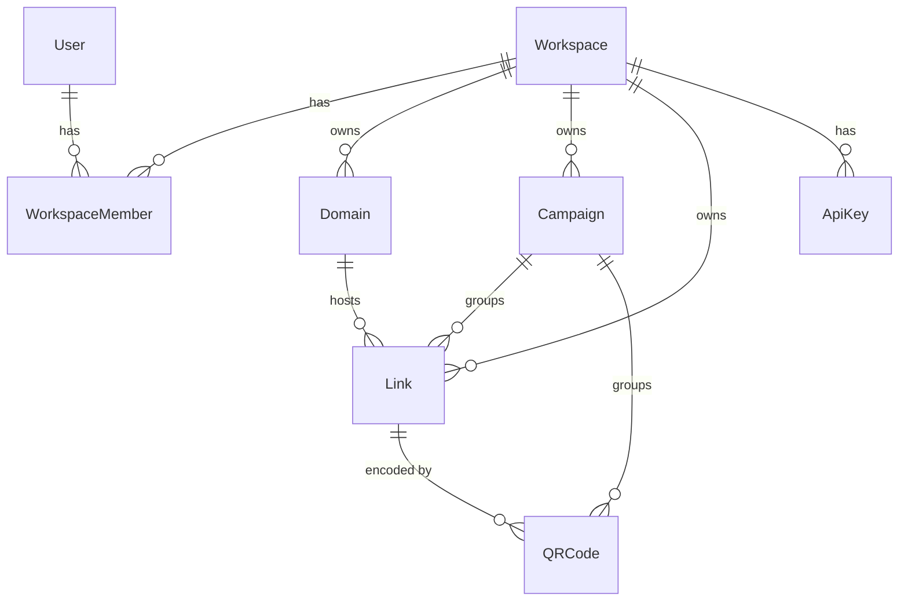

# Database

PostgreSQL via Prisma. Schema: `packages/database/prisma/schema.prisma`.

## Key constraints

- `Domain.hostname` is globally unique: a hostname belongs to exactly one workspace.
- `Link (domainId, slug)` is unique, so `go.a.com/sale` and `b.com/sale` can coexist. This index also serves the redirect cache-miss lookup.
- Deleting a campaign sets `Link.campaignId` / `QRCode.campaignId` to null; deleting a link cascades to its QR codes.

## Analytics tables

`ClickEvent` has no foreign keys on purpose: cheap bulk inserts, and history outlives links. `eventId` is the primary key so retried worker batches are idempotent. Dashboards read `AnalyticsDaily` and `AnalyticsDimensionDaily`; `DailyVisitor` is a dedupe table used to count unique visitors incrementally. See [analytics.md](analytics.md).

## Indexes

Added for a concrete query each: link list pagination `(workspaceId, createdAt desc, id desc)`; analytics reads `(workspaceId|linkId|campaignId, timestamp/date)`; `ClickEvent(timestamp)` for retention deletes. Re-evaluate with `EXPLAIN` after load tests.

## Partitioning

Not used. Revisit (by month on `timestamp`) only if load tests or retention deletes show it is needed.
