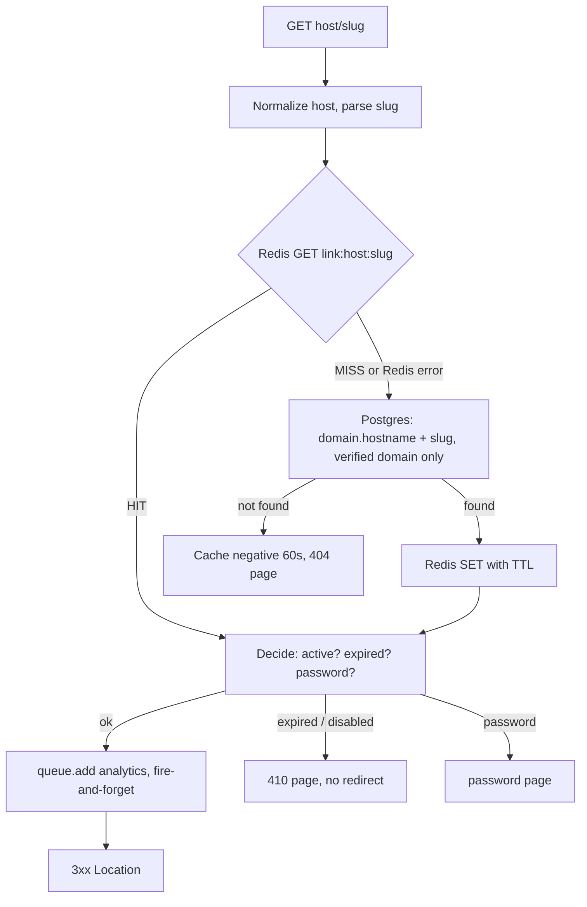

# Redirect system

Goal: Redis GET, enqueue, 3xx. Nothing else on the hot path.

## Cache entry (`link:{hostname}:{slug}`)

Contains only `linkId, workspaceId, campaignId, destinationUrl (UTM already merged), active, expiresAt, hasPassword, status`. No secrets; password hashes are never cached, and protected links are not cached as open redirects.

## Cache safety

Keys are built from the normalized `Host` header and slug; unknown hosts never reach Postgres tenant data because lookup joins on a verified `Domain`. Unknown-host and not-found results are negatively cached briefly.

## Invalidation

Every link/domain mutation commits to Postgres, then deletes the Redis key (and old key on slug/domain change). TTL (default 1h) is only a backstop.

## Failure behaviour

| Failure             | Behaviour                                                                                         |
| ------------------- | ------------------------------------------------------------------------------------------------- |
| Redis down          | Fall back to Postgres, log error.                                                                 |
| Queue/enqueue fails | Log, redirect anyway.                                                                             |
| Postgres down       | Cached links still redirect; uncached links return 503; mutations and analytics persistence fail. |

## Status codes

Default 302 (destination can be edited). 301/308 are cached by browsers indefinitely, so edits may not reach returning visitors; 307/308 preserve the HTTP method. Configurable globally (`REDIRECT_STATUS`) and per link.

## Invalidation details (implemented in `apps/api/src/services/cache.ts`)

- Every link create/update/enable/disable/delete deletes the old **and** new `link:{host}:{slug}` key after the Postgres commit. Creating a link also clears any negative-cache entry for that slug.
- **Second delete:** a redirect that read the old row just before the commit could re-write the stale value just after our first `DEL`. The API repeats the delete 2 s later (best effort, in-process timer) to close that window; the TTL is the final backstop.
- Disabling a domain deletes every cached key under it, in batches of 1000.
- If Redis is down, the mutation still succeeds; the failure is logged at error level and stale entries live at most `REDIRECT_CACHE_TTL_SECONDS`. This is a deliberate availability-over-freshness tradeoff.
- Password-protected links cache `destinationUrl: null`, so a cache hit can never produce an open redirect; the key format and entry shape live in `packages/shared/src/redirectCache.ts`.
