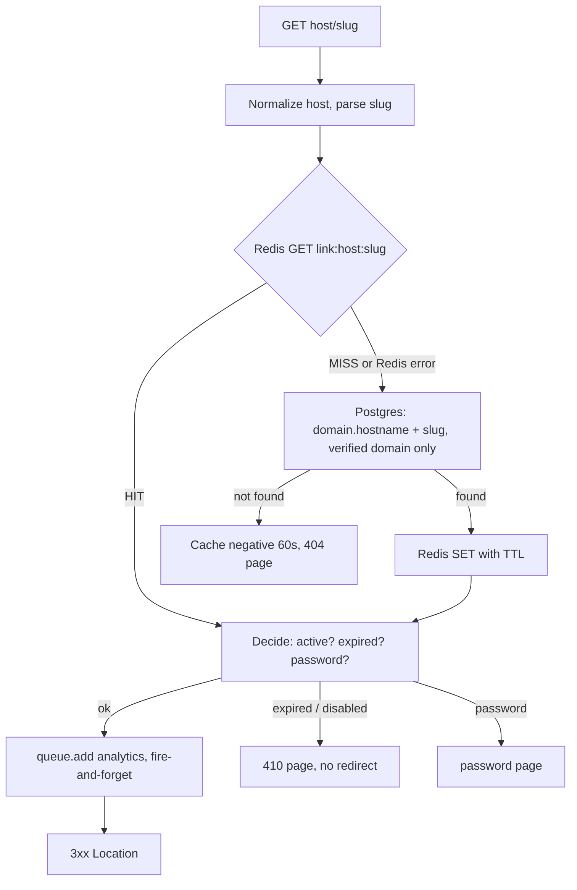

# Redirect system

Goal: Redis GET, enqueue, 3xx. Nothing else on the hot path.

## Cache entry (`link:{hostname}:{slug}`)

Contains only `linkId, workspaceId, campaignId, destinationUrl (UTM already merged), active, expiresAt, hasPassword, status`. No secrets; password hashes are never cached, and protected links are not cached as open redirects.

## Cache safety

Keys are built from the normalized `Host` header and slug; unknown hosts never reach Postgres tenant data because lookup joins on a verified `Domain`. Unknown-host and not-found results are negatively cached briefly.

## Invalidation

Every link/domain mutation commits to Postgres, then deletes the Redis key (and old key on slug/domain change). TTL (default 1h) is only a backstop.

## Failure behaviour

| Failure             | Behaviour                                                                                         |
| ------------------- | ------------------------------------------------------------------------------------------------- |
| Redis down          | Fall back to Postgres, log error.                                                                 |
| Queue/enqueue fails | Log, redirect anyway.                                                                             |
| Postgres down       | Cached links still redirect; uncached links return 503; mutations and analytics persistence fail. |

## Status codes

Default 302 (destination can be edited). 301/308 are cached by browsers indefinitely, so edits may not reach returning visitors; 307/308 preserve the HTTP method. Configurable globally (`REDIRECT_STATUS`) and per link.

## Invalidation details (implemented in `apps/api/src/services/cache.ts`)

- Every link create/update/enable/disable/delete deletes the old **and** new `link:{host}:{slug}` key after the Postgres commit. Creating a link also clears any negative-cache entry for that slug.
- **Second delete:** a redirect that read the old row just before the commit could re-write the stale value just after our first `DEL`. The API repeats the delete 2 s later (best effort, in-process timer) to close that window; the TTL is the final backstop.
- Disabling a domain deletes every cached key under it, in batches of 1000.
- If Redis is down, the mutation still succeeds; the failure is logged at error level and stale entries live at most `REDIRECT_CACHE_TTL_SECONDS`. This is a deliberate availability-over-freshness tradeoff.
- Password-protected links cache `destinationUrl: null`, so a cache hit can never produce an open redirect; the key format and entry shape live in `packages/shared/src/redirectCache.ts`.

## Implementation notes (`apps/redirect`)

Raw `node:http`, no framework: nothing on the hot path parses bodies, runs middleware or matches a router. Routes: `GET|HEAD /:slug`, `POST /:slug/unlock`, `/health`, `/ready`, and `/` (302 to `APP_URL` on the shared domain, 404 elsewhere).

### Link states

| State                                        | Response                                                 | Counted as a click   |
| -------------------------------------------- | -------------------------------------------------------- | -------------------- |
| active                                       | `REDIRECT_STATUS` (default 302) or the link's own status | yes                  |
| disabled                                     | `410` page                                               | no                   |
| expired (`expiresAt <= now`)                 | `410` "This link has expired" page                       | no                   |
| unknown slug / unverified or disabled domain | `404` page                                               | no                   |
| password-protected                           | `200` password form; correct password → `303`            | on successful unlock |
| Postgres down and not cached                 | `503` page                                               | no                   |

Set `LINK_UNAVAILABLE_REDIRECT_URL` to redirect disabled/expired/unknown links to a URL of your choice instead of showing pages. `HEAD` requests (link-preview probes, uptime checks) get the same answer but are not counted.

`301`/`308` responses send `Cache-Control: private, max-age=3600`, so browsers will skip us (and analytics) on repeat visits; `302`/`307` send `no-store`. Query strings on the short URL are not forwarded to the destination.

### Protections on the miss path

- **Single-flight:** concurrent misses for one key share one Postgres query, so a cold viral link costs one query, not one per request.
- **Known-host gate:** a "not found" is negative-cached (60 s) only if the hostname is a verified domain (`DomainRegistry`, in-process, 30 s TTL, 5000 entries). Random `Host` values therefore cannot create Redis keys, and lookups for unknown hosts are capped at 50/s per process; beyond that they are answered 404 without touching the database.
- **TTL jitter:** ±10 % on cache TTL so entries filled together do not expire together.
- **Hostile cache values:** corrupt JSON is repaired from Postgres; a cached destination that is not plain `http(s)` or contains whitespace/control characters (header injection) is refused.
- **Log throttling:** a Redis outage logs once per 5 s rather than once per request.

### Password links

The cache entry carries `hasPassword: true, destinationUrl: null`, so a cache hit cannot leak or follow the destination. `POST /:slug/unlock` loads the hash from Postgres, verifies with Argon2, and answers `303` (the browser follows with GET, so the password is never replayed). Guesses are limited to 10 per 15 minutes per link and client IP, and **fail closed**: if Redis is down, unlock is refused (503).

### Client IP

`TRUST_PROXY` has the same meaning as in the API (same `proxy-addr` library): `X-Forwarded-For` is honoured only for configured proxy hops. The raw header is also recorded in the event for diagnostics, but never trusted.

### Operating notes

- Raise the listen backlog on the host for burst traffic (`net.core.somaxconn`, Linux default 4096 on recent kernels; macOS defaults to 128, which resets very large simultaneous connect bursts in local tests).
- Analytics publishing is behind the `AnalyticsPublisher` interface; the service currently ships with a no-op publisher until the BullMQ publisher lands with the analytics worker.
